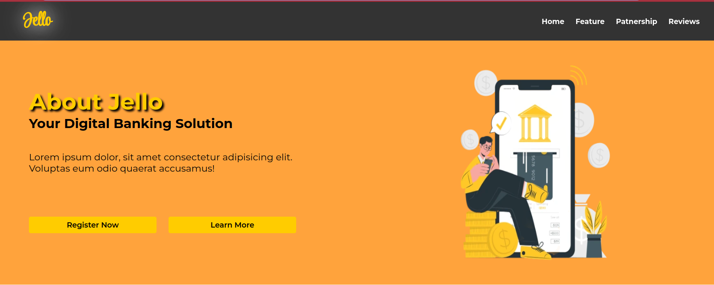
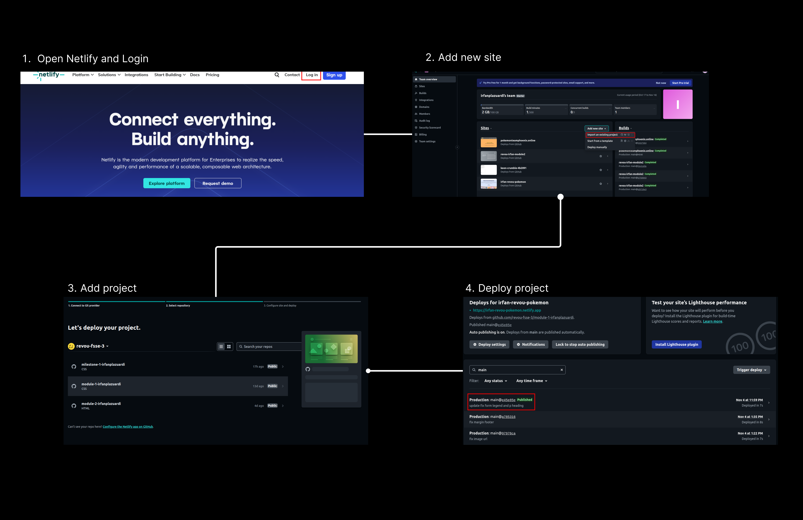

## About Website


Hi, I'am Irfan. I would like to present my website Jello which is a digital banking app use to help for your digital needs. I designed this simple website with yellow and orange theme which is a bright eye catching color for this website. I have make sure this website is responsive for mobile and tablet users.
For any feedback feel free to contact me [linkedin](https://www.linkedin.com/in/irfan-prima-lazuardi-316731a8/)

## Structure

- Navbar
- Header
- Main
  - Feature section
  - Patnership section
  - Review section
- Footer

## Dependencies & External libraries

- HTML
- CSS
- JavaScript
- External/Internal Source
  - font awesome
  - image
  - font

## How To Set Up

### Setup Project

To be able to access this project, make sure you have a github account and you can follow these steps:

1. Clone this repository
   `https://github.com/revou-fsse-3/milestone-1-irfanplazuardi.git`
2. Create a new branch name "development" to seperate branch with main branch
   `git branch -b "development"`
3. Checkout to the new branch
   `git checkout -b "development`
4. Modify the website with your personal preferences, once it isdone you will need to push your code

```
git add.
git commit -m "update message" //make sure to be descriptive as possible
git push origin development
```

5. Once its done, you can merge the code into main branch for production build

```
git checkout main
git pll origin main
git merge development
git commmit -m "merge development to main"
git push origin main
```

### Setup Fontawesome

1. open [cdn fontawesome](https://cdnjs.com/libraries/font-awesome) and copy the latest library link
   `https://cdnjs.cloudflare.com/ajax/libs/font-awesome/6.4.2/css/all.min.css`
2. Open your project in vscode and paste link inside the html head
3. Next to choose your desired fontawesome icon at [fontawesome.com](https://fontawesome.com/)
4. Search your icon by clicking the search button and type your desired icon example "Instagram"
5. Set icon design from color, animation, size and position
6. copy html code
7. Go back to vscode html file paste the code, you can style it manually in html to get the exact size and color.
   ` <i class="fa-brands fa-instagram" style="color: #ec0909; font-size: 4rem"></i>">`
8. Check your code by clicking go live (make sure you have install extension[Live Server](https://marketplace.visualstudio.com/items?itemName=ritwickdey.LiveServer) in vscode )

### Setup Font

1. Open [googlefont](https://fonts.google.com/)
2. Search fonts name from the search bar "Montserrat"
3. Click on the font option
4. Click download family
5. Extract font in your local computer
6. Open folder and copy file "Montserrat-VariableFont_wght.ttf"
7. Open your project in vscode and paste font in your asset font folder
8. To apply font you must add font face in your css with font family name and src file path

```
@font-face {
  font-family: StyleScript;
  src: url(asset/fonts/StyleScript-Regular.ttf);
}
```

9. Apply your font in your desired field

```
body {
  font-family: Montserrat;
}
```

10. Check your code by clicking go live in your vscode

## Deployment

In this project I use netlify. You can access my website here [Jello](https://pokemonteamphoenix.online/). Follow these steps to deploy your website:

### Connect Your Project with Netlify

1. Open [netlify](https://www.netlify.com/)
2. Login and then add new site with import an existing project
3. Select deploy with github then select your project from repository
4. Click on deploy (repository name)
5. Wait for several minutes to build your website and makes sure status is published
   

### Deploy With Custom Domain

The custom domain I use in this project is from niagahoster. So make sure to purchase a domain before proceeding through these steps:

1. Select your deployed sites from netlify dashboard
2. Click on set up a custom domain
3. Input your domain address and click verify then continue till it shows DNS address
4. Copy the DNS adrress
5. Open niagahoster then login
6. Select your domain and go to DNS / Nameservers
7. Click change name server and paste DNS from netlify
8. Click Save then wait 1x24 hours to make sure the website deployed
   
